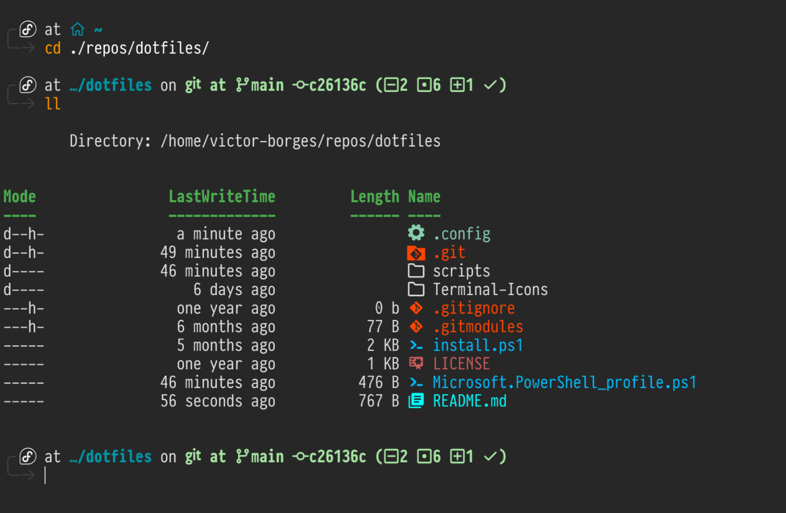

# 🔧 dotfiles



## Prerequisites

Have [Powershell Core](https://github.com/PowerShell/PowerShell) and [starship.rs](https://starship.rs) installed.

## Installation

The installation script will copy some files to your home folder and install the required packages.

```powershell
git clone https://github.com/victor-borges/dotfiles --recurse-submodules
cd dotfiles
Set-ExecutionPolicy Bypass -Scope Process -Force
./install.ps1
```

If you only want to use the starship theme, copy `starship.toml` to `~/.config` and you should be good to go!

## Credits

Inspired by the video [How to customize Windows 11 Terminal // WSL2, PowerShell](https://www.youtube.com/watch?v=AK2JE2YsKto) by [The Digital Life](https://www.youtube.com/channel/UCZNhwA1B5YqiY1nLzmM0ZRg)
